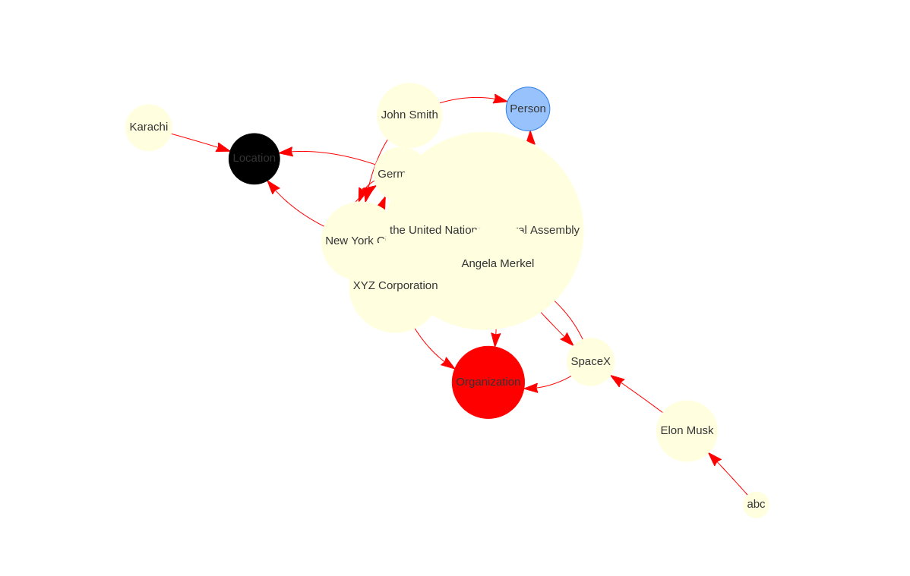

# News Graph

Key information extration from text and graph visilization. Inspired by [TextGrapher](https://github.com/liuhuanyong/TextGrapher).

# Project Introduction

How to represent a text in a simple way is a chanllenge topic. This peoject try to extraction key information from the text by NLP methods, which contain NER extraction, relation detection, keywords extraction, frequencies words extraction. And finally show the key information in a graph way.

# How to use
# clone this repo
```bash
   git clone https://github.com/kernel-loophole/KG-graph
```
Edit the main file with your text
# run this main.py file to genrate html file 


```python
from news_graph import NewsMining
content = 'Input you text here'
Miner = NewsMining()
Miner.main(content)
```
```bash
   python3 main.py
```
This will generate the `graph.html`. 

# Example Demo

1) [Blockbuster *The Wandering Earth*](https://www.theverge.com/2019/2/9/18218479/the-wandering-earth-review-film-china-first-science-fiction-blockbuster-cixin-liu-gravity-the-core)

<!-- 
2) [Tokyo Marathon 2019 Elite Field](https://www.marathon.tokyo/en/news/detail/news_001178.html)

)

3) [EVEN ANONYMOUS CODERS LEAVE FINGERPRINTS](https://www.wired.com/story/machine-learning-identify-anonymous-code/?utm_campaign=Deep%20Learning%20Weekly&utm_medium=email&utm_source=Revue%20newsletter)
 -->
# Loading the SpaCy Model
The following line initializes the SpaCy language model for English language processing:
```python
nlp = spacy.load('en_core_web_lg')
```
The model loaded here is 'en_core_web_lg', which is a large English language model trained on web text data.

# Defining the NewsMining Class
The code defines a Python class named NewsMining, encapsulating functionality related to news mining:
Initializing the NewsMining Class
The constructor method (__init__) initializes various attributes of the NewsMining class:

```python

class NewsMining():
    """News Mining"""

def __init__(self):
    # Initialize TextRank for keyword extraction
    self.textranker = TextRank()
    self.events = []  # Store extracted events
    self.result_dict = {}  # Store NER results
    self.ners = ['PERSON', 'ORG', 'GPE']  # Named Entity Recognition (NER) tags
    # Mapping of NER tags to categories
    self.ner_dict = {
        'PERSON': 'Person',
        'ORG': 'Organization',
        'GPE': 'Location',
    }
    # Dependency markers for subjects and objects
    self.SUBJECTS = {"nsubj", "nsubjpass", "csubj", "csubjpass", "agent", "expl"}
    self.OBJECTS = {"dobj", "dative", "attr", "oprd"}
    self.graph_shower = GraphShow()  # Object for displaying graphs
```
# Additional Methods
The code snippet also includes additional methods such as clean_spaces, remove_noisy, and collect_ners, which perform tasks like cleaning text, removing noisy characters, and collecting named entities, respectively.

Explanation of Python Code for News Mining
Extracting Triples
The extract_triples method takes a sentence as input and returns Subject-Verb-Object (SVO) triples:

```python
def extract_triples(self, sent):
    svo = []
    tuples = syntax_parse(sent)
    child_dict_list = build_parse_chile_dict(sent, tuples)
    for tuple in tuples:
        rel = tuple[-1]
        if rel in self.SUBJECTS:
            sub_wd = tuple[1]
            verb_wd = tuple[3]
            obj = self.complete_VOB(verb_wd, child_dict_list)
            subj = sub_wd
            verb = verb_wd.text
            if not obj:
                svo.append([subj, verb])
            else:
                svo.append([subj, verb + ' ' + obj])
    return svo
```
# Extracting Keywords
The extract_keywords method extracts the top 10 keywords from a list of word-postag pairs:
```python 
def extract_keywords(self, words_postags):
        return self.textranker.extract_keywords(words_postags, 10)
```
# Main Method for News Mining
The main method is a placeholder for the main functionality of news mining:

```python
def main(self, contents):
    '''Main function'''
    words_postags = []  # token and its POS tag
    ner_sents = []  # store sentences which contain NER entity
    ners = []  # store all NER entity from whole article
    triples = []  # store subject verb object
    events = []  # store events

    for content in tqdm(contents):
        # 01 remove linebreaks and bracketst
        try:
            content = remove_noisy(content + ".")
            content = clean_spaces(content)

            # 02 split to sentences
            doc = nlp(content)

            for i, sent in enumerate(doc.sents):
                words_postags = [[token.text, token.pos_] for token in sent]
                words = [token.text for token in sent]
                postags = [token.pos_ for token in sent]
                ents = nlp(sent.text).ents  # NER detection
                collected_ners = self.collect_ners(ents)

                if collected_ners:  # only extract triples when the sentence contains 'PERSON', 'ORG', 'GPE'
                    triple = self.extract_triples(sent)
                    if not triple:
                        continue
                    triples += triple
                    ners += collected_ners
                    ner_sents.append(
                        [token.text + '/' + token.label_ for token in sent.ents])

            #       03 get keywords
            keywords = [i[0] for i in self.extract_keywords(words_postags)]

            for t in triples:
                if (t[0] in keywords or t[1] in keywords) and len(t[0]) > 1 and len(t[1]) > 1:
                    events.append([t[0], t[1]])
            # print(events)
            # 05 get word frequency and add to events
            # identifies the most common words (nouns, proper nouns, and verbs) in the text and categorizes them as "frequency."
            word_dict = [i for i in Counter([i[0] for i in words_postags if i[1] in [
                'NOUN', 'PROPN', 'VERB'] and len(i[0]) > 1]).most_common()][:10]

            # dumpy_ner={i[0]: i[1] for i in Counter(ners).most_common(20)}
            ner_dict = {i[0]: i[1] for i in Counter(ners).most_common(20)}
            # print(ner_dict)
            for ner in ner_dict:
                name = ner.split('/')[0]  # Jessica Miller
                cate = self.ner_dict[ner.split('/')[1]]  # PERSON
                events.append([name, cate])
            # print(events)
            # 07 get all NER entity co-occurrence information
            # here ner_dict is from above 06
            co_dict = collect_coexist(ner_sents, list(ner_dict.keys()))
            co_events = [[i.split('@')[0].split(
                '/')[0], i.split('@')[1].split('/')[0]] for i in co_dict]
            # events += co_events
            # print(ner_dict.keys())
            # print(events)
            result_dict = {}

            for item in ner_dict:
                parts = item.split('/')
                if len(parts) == 2:
                    key, value = parts
                    result_dict[key] = value
        except:
            pass
    events += co_events
    with open('test_json.json', 'r') as file:
        data = json.load(file)
    print(data['edges'])
    lables = []
    for i in data['edges']:
        lables.append(i['label'])
    # print(events)
    for k, i in enumerate(events):
        for j in i:
            # print(j)
            if j in lables:
                pass
            else:
                # print(i)
                try:
                    events.remove(i)
                    events_test = [sublist for l, sublist in enumerate(events) if l != k]

                except:
                    pass
    tmp_event = []
    Ner_data = {"Person": 0, "Location": 0, "Organization": 0}
    test_data = []

    for k, i in enumerate(events):

        if i[1] == "Organization":
            Ner_data['Organization'] += 1
        if i[1] == "Location":
            Ner_data['Location'] += 1
        if i[1] == "Person":
            Ner_data['Person'] += 1
        # print("removing",i) 
        # events = [sublist for l, sublist in enumerate(events) if l != k]
    org_count = 0
    for k, i in enumerate(events):

        tmp_dir_ner = []

        if org_count < 3:
            if i[1] == "Organization":
                print("in if org")
                tmp_dir_ner.append(i[0])
                tmp_dir_ner.append('Person')
                events.append(tmp_dir_ner)
                org_count += 1
            if i[1] == "Location":
                print("in if")
                tmp_dir_ner.append(i[0])
                tmp_dir_ner.append('Person')
                events.append(tmp_dir_ner)
                org_count += 1
            if i[1] == "Person":
                tmp_dir_ner.append(i[0])
                tmp_dir_ner.append('Location')
                events.append(tmp_dir_ner)
                org_count += 1
        # print("ji",i,lables)
        else:
            # print("removing",i) 
            events = [sublist for l, sublist in enumerate(events) if l != k]
    print(events)
    seen = set()
    unique_data = [x for x in events if tuple(x) not in seen and not seen.add(tuple(x))]
    with open('graph_gen/graph_data.json', 'r') as file:
        match_events = json.load(file)
    data_edges = match_events['edges']
    print(data_edges)
    ner_to_check = 'GPE'
    tmp_unique = []
```
# Getting Extracted Events and NER Results
The get_events method returns the extracted events and Named Entity Recognition (NER) results:
```python
def get_events(self):
        return self.events, self.result_dict
```
Instantiating the NewsMining Class
The NewsMining class is instantiated as news_miner:
# Call the class object
```python
news_miner = NewsMining()
```
