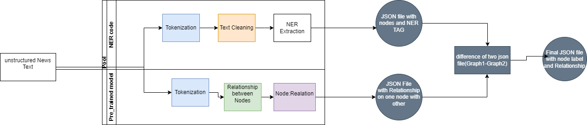
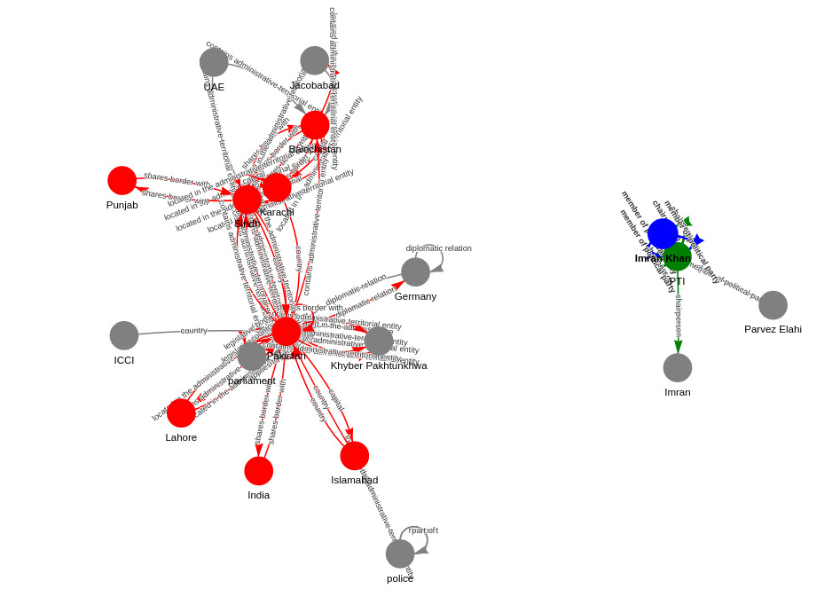
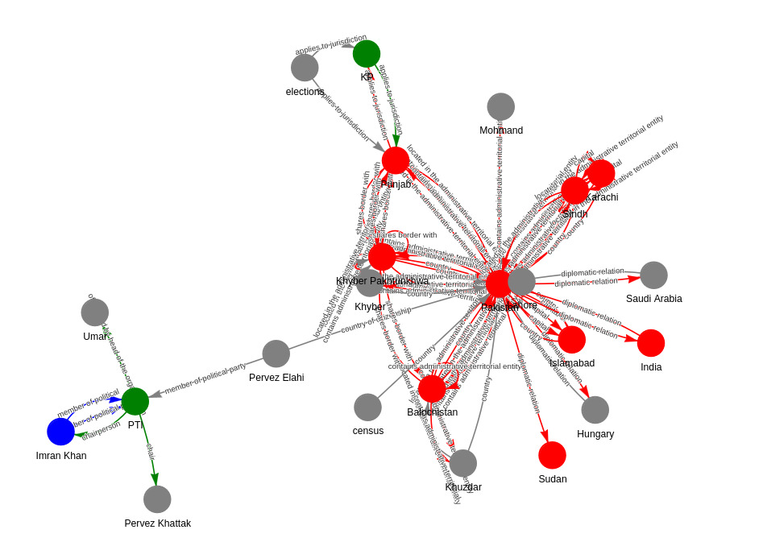
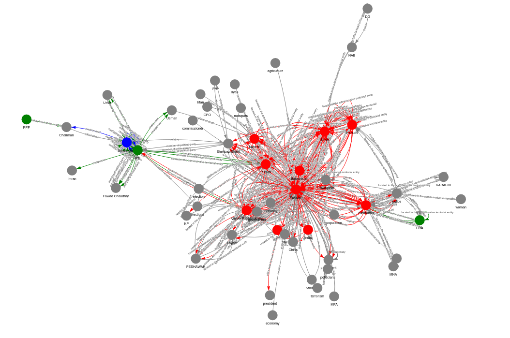

# News Graph

Key information extration from text and graph visilization. Inspired by [TextGrapher](https://github.com/liuhuanyong/TextGrapher).

# Project Introduction

How to represent a text in a simple way is a chanllenge topic. This peoject try to extraction key information from the text by NLP methods, which contain NER extraction, relation detection, keywords extraction, frequencies words extraction. And finally show the key information in a graph way.please read the blog for more in depth details. https://fir-speedboat-5ee.notion.site/Building-Knowledge-Graphs-Using-Python-82276798233c45e8a85280e4a9308a5c?pvs=25

1) 

# Example Demo

1) 

1) 

2) 

# Node coloring
- Red:Location 
- Blue:Person 
- Green:organization   
- Grey:other
# usage
1. **Run `main.py`**: This script will generate the `graph_data.json` file.
2. **Run `main_kg.py`**: This script will generate the `graph_data_kg.json` file.
3. **Run `difference.py`**: This script will compute the difference between the generated files.
4. **Run `find_ner.py`**: This script will filter the data based on Named Entity Recognition (NER).
5. **Run `ner_plot.py`**: This script will generate the HTML file for graph visualization .